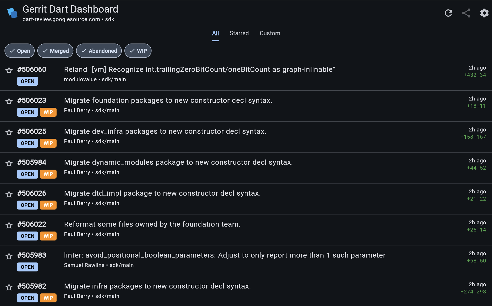

<h1 align="center">Gerrit Dart Dashboard</h1>

<p align="center">
  An experimental Gerrit Dashboard rewritten in Flutter.<br>
  Read-only and anonymous, for the Dart SDK Gerrit instance.<br>
  Flutter web, compiled to <strong>WebAssembly</strong>.
</p>

<p align="center">
  <a href="https://lab.modulovalue.com/gerrit-dashboard-v2/"><strong>Live: lab.modulovalue.com/gerrit-dashboard-v2/</strong></a>
</p>

<p align="center">
  
</p>

## What is Gerrit?

[Gerrit](https://www.gerritcodereview.com/) is a web-based code review system originally built at Google and now used by projects like Chromium, Android, Go, and the Dart SDK. Contributors push commits as **changes** (CLs); each CL flows through review, automated verification, and a `Code-Review +2` approval before being submitted to the repository. The Dart SDK lives on the public Gerrit instance at [dart-review.googlesource.com](https://dart-review.googlesource.com).

---

## What it does

A single page over `dart-review.googlesource.com` that lets you:

- See open / merged / abandoned CLs in the Dart SDK (`sdk` project), filtered by chips with persistent state and Cmd/Ctrl-click for exclusive select.
- Drop into a per-user view via `/u/<user>`. Shareable URLs, no recipient setup needed.
- Star CLs as anonymous client-side bookmarks; the **Starred** tab fetches them by change number.
- Infinite-scroll through results (Gerrit pagination via `_more_changes`).
- Run free-form Gerrit search syntax under the **Custom** tab. Chips compose into your query unless you've typed an explicit `status:`.

Inspired by [`kevmoo/scripts.dart` → `gerrit-view`](https://github.com/kevmoo/scripts.dart#gerrit-view), reduced to the half that does not require local git access.

## Why Flutter

This is **a perfect use case for Flutter**:

- A single codebase ships to the browser (today, via `flutter build web --wasm`) and could ship to macOS/Windows/Linux desktop tomorrow with no architectural change. The Dart-side bindings in `packages/gerrit_api/` are platform-agnostic.
- The ideal next step is a companion **Flutter desktop app** that augments the web app with what the browser fundamentally can't see: the on-device Dart SDK worktree. It would surface the local-git half of the original `gerrit-view` script (branch to CL mapping via `branch.*.gerritissue`, shadow-fetch alignment checks `✅ IN SYNC` / `✅ CONTENT IDENTICAL` / `⚠️ DIVERGED`, conflated-branch warnings, and cleanup safety checks via `git cherry`), running over the same `gerrit_api` package the web app uses.
- Wasm output keeps the runtime small and the rendering crisp; the dashboard ships ~30 MB of static assets and starts cold in well under a second.

## Repo layout

Dart 3.10 workspace, two packages:

- `packages/gerrit_api/`: pure Dart REST bindings for the anonymous Gerrit REST API (no Flutter dependency). Strips Gerrit's `)]}'` XSSI prefix, parses change/revision/account/message models, returns `({changes, hasMore})` from `queryChanges` so paginators can chain.
- `packages/gerrit_dashboard/`: Flutter web app built on `gerrit_api`. Riverpod, go_router, `usePathUrlStrategy`, no service worker.

## Quick start

```sh
# Local dev: the CORS proxy in one terminal,
dart run gerrit_dashboard:dev_proxy

# ...and the app in another.
cd packages/gerrit_dashboard
flutter run -d chrome --wasm
```

The dev proxy listens on `http://localhost:8080` and forwards every request
to `https://dart-review.googlesource.com`, stamping CORS headers on the way back.
The app defaults to `localhost:8080` in debug, so this works with no
configuration.

## Release build

```sh
cd packages/gerrit_dashboard
flutter build web --wasm --base-href /gerrit-dashboard-v2/ --pwa-strategy=none --release
```

Artifacts land in `packages/gerrit_dashboard/build/web/`. The release defaults
auto-detect the host from `document.baseURI`, so the same bundle works at any
deploy path.

## Deployment shape

This deployment terminates at lab.modulovalue.com:

```
browser  ─┐
          ▼
nginx ── /gerrit-dashboard-v2/         → static files (Wasm bundle)
      └─ /gerrit-dashboard-v2/gerrit-api/  → https://dart-review.googlesource.com/
```

The reverse-proxy block in nginx adds `Access-Control-Allow-Origin: *` and is
restricted to `GET / HEAD / OPTIONS`. The app sends no credentials and reads
only anonymous endpoints (no `/a/` prefix). **The CORS proxy is hardcoded to
dart-review**. Other Gerrit instances need their own deployments.

## Tests

```sh
cd packages/gerrit_api && dart test            # 11 cases
cd packages/gerrit_dashboard && flutter test   # 14 cases
```

## Authorization

None. The app uses anonymous Gerrit endpoints (no `/a/` prefix). Implications:

- It cannot resolve `owner:self`. Set "Default user" in Settings, or type `owner:alice` in the Custom tab.
- It cannot see private CLs.
- "Open in Gerrit" links go to the public Gerrit web UI as anyone-without-auth would see it.

## Out of scope vs. the original `gerrit-view`

Things the script does that this app deliberately doesn't (yet, see *Why Flutter*):

- Local branch detection (`branch.*.gerritissue` config)
- `git fetch` / shadow alignment / tree-hash comparisons
- Cleanup safety checks (`git cherry`)
- "Conflated branches" detection
- Authenticated endpoints

## Contributing

Issues are very welcome: bugs, missing CL data, paper cuts, ideas.
**[github.com/modulovalue/gerrit-dashboard-v2/issues](https://github.com/modulovalue/gerrit-dashboard-v2/issues/new)**.
